# UI Localization

## Introduction

Mac OS X supports loading nib files out of language folders to provide a means
of localization
([Apple's Localization Documentation](http://developer.apple.com/internationalization/localization/)).
However depending on the complexity of a product's UI, that can greatly enlarge
the size of the resulting application bundle.  GTM provides some support for
doing basic runtime localization so developer don't need to maintain copies of
their nibs for every language.

## `GTMUILocalizer`

`GTMUILocalizer` can be used from code or within a nib file to localize string
data in a UI.  When used within a nib file, at `awakeFromNib`, it will walk the
UI objects it is wired to, and attempt to localize all strings that start with a
caret by looking them up in the `.strings` files to get the translations.  You
can also subclass `GTMUILocalizer` to override how the strings are looked up to
put some other backend in place.  Please see the
[header file](https://github.com/google/google-toolbox-for-mac/blob/main/AppKit/GTMUILocalizer.h)
for more details on how to use `GTMUILocalizer`.

## `GTMUILocalizerAndLayoutTweaker`

When localizing a UI, it is not uncommon that the UI needs to have some of its
size/layout adjusted to handle the different string lengths that can result from
translation.  `GTMUILocalizerAndLayoutTweaker` builds on `GTMUILocalizer` to
provide some simple adjustments to UIs so you can avoid having to maintain
multiple nib files.  Since it is just about impossible to handle all possible
needs, `GTMUILocalizerAndLayoutTweaker` provides some flexibility in how it is
used:

- You can use it on a per window/view bases.  In that you can let it fix up just
  some of your UI, and handle the rest other ways (though your own code, through
  `.lproj` folders, etc.).

- You can use it with a nib file living in `Application.app/Contents/Resources`
  to handle most locales, then for the small number of locales that still need
  some more manual tweaking, you can maintain a nib specific to those languages
  in the right `.lproj` subfolder.

The [header file](https://github.com/google/google-toolbox-for-mac/blob/main/AppKit/GTMUILocalizerAndLayoutTweaker.h)
for `GTMUILocalizerAndLayoutTweaker` gives a basic overview of what is possible,
but this is one of those case where some examples and pictures can greatly help;
so with further delay...

### Nib Setup

Add a new `NSObject` to your nib file, and set the class to
`GTMUILocalizerAndLayoutTweaker`.  Then wire the `localizerOwner_` outlet to the
nib owner, and wire the `uiObject_` to the object that you want to be localized
and _tweaked_ (a window or view).

If you need a custom subclass of `GTMUILocalizer`, you can also add that to the
nib and wire the `localizer_` outlet to it (when you don't provide this, a stock
`GTMUILocalizer` is used, and the `localizerOwner_` is used so it can figure out
where to load its strings for localization.

_NOTE:_ Do **not** wire up any of the `GTMUILocalizer`'s outlets, see the next
section for why.

### `awakeFromNib` Work

When the `GTMUILocalizerAndLayoutTweaker` receives `awakeFromNib` it does the
following, in order:
  1. If `localizer_` is unset, creates a `GTMUILocalizer`.
  1. Passes `uiObject_` to `localizer_` to have all marked strings in the UI
     localized.
  1. Recursively walks the hierarchy of `uiObject_` looking for instances of
     `GTMWidthBasedTweaker` and letting them do their layout work.

_NOTE_: Step 2 is an important detail here.  You do not want to wire up any
outlets from a `GTMUILocalizer` you are using with a
`GTMUILocalizerAndLayoutTweaker `.  The order that all `awakeFromNib` methods
are called is not well defined (it depends on the graph created by the objects
in the nib,
[Apple's docs on awakeFromNib](http://devworld.apple.com/documentation/Cocoa/Reference/ApplicationKit/Protocols/NSNibAwaking_Protocol/Reference/Reference.html#//apple_ref/occ/instm/NSObject/awakeFromNib)),
so there is no way to say for sure that the `GTMUILocalizer` will get awoken
before the `GTMUILocalizerAndLayoutTweaker`.

### `GTMWidthBasedTweaker`

`GTMWidthBasedTweaker` is a custom `NSView` that causes its children to try and
size to their content.  Basically, it loops over its children calling
`sizeToFit` on any that support the selector, and then tries to use their layout
and `autosizingMask` to get them in the right positions.  Base on the size
changes of its children, it can optional adjust other objects.

#### _Example:_ A row of buttons right align to the window

Create the nib file, and set the titles to be your localization keys:

Then select the two buttons and tell Interface Builder to embed the objects into
a Custom View, and set the class of that view to `GTMWidthBasedTweaker`.  Set
the struts on the `GTMWidthBasedTweaker` so it is anchored to the bottom and
right but unanchored to the top and left.

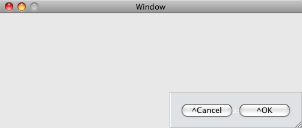 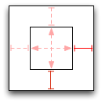

Wire in the `GTMUILocalizerAndLayoutTweaker`, and at runtime, you'll see
something like this:

#### _Example:_ A couple of checkboxes that keep the clickable areas limited to text length

Create the nib file, and set the titles to be your localization keys:

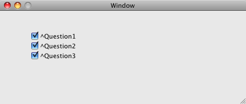

Then select the checkboxes and tell Interface Builder to embed the objects into
a Custom View, and set the class of that view to `GTMWidthBasedTweaker`.  Set
the struts on the `GTMWidthBasedTweaker` so it is anchored to the top and left
but unanchored to the bottom and right.

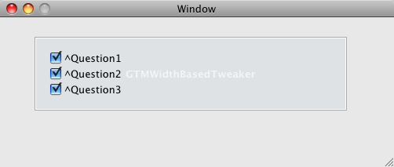 

Wire in the `GTMUILocalizerAndLayoutTweaker`, and at runtime, you'll see
something like this:

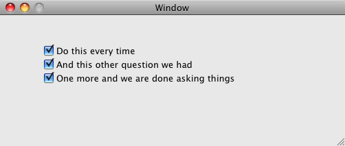

#### _Example:_ A label and a text field where as the the label grows/shrinks for its text, the text field will move and grow/shrink to consume balance the label

Create the nib file, and set the title to be your localization key:

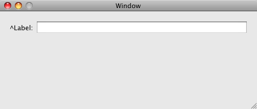

Then select the label and tell Interface Builder to embed the object into a
Custom View, and set the class of that view to `GTMWidthBasedTweaker`.  Set the
struts on the `GTMWidthBasedTweaker` so it is anchored to the top and left but
unanchored to the bottom and right.

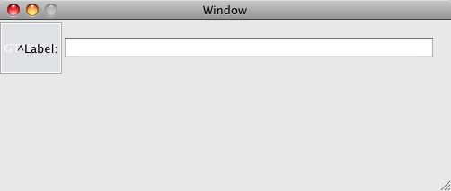 

Now wire the `viewToSlideAndResize_` outlet of the `GTMWidthBasedTweaker` to the
text field. Lastly, wire in the `GTMUILocalizerAndLayoutTweaker`, and at
runtime, you'll see something like this:

#### _Example:_ A set of labels and a text fields that stay aligned and the text field balances the label size changes

Create the nib file, and set the title to be your localization key:

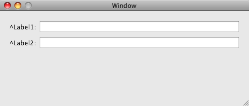

Then select the labels and tell Interface Builder to embed the objects into a
Custom View, set the class of that view to `GTMWidthBasedTweaker`.  Then select
the text fields and embed them in a Box.  The box should be made transparent,
but in the the diagram below we're making it visible so you can see what the
setup looks like:

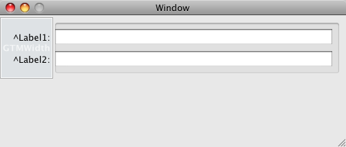

Set the struts on the `GTMWidthBasedTweaker` so it is anchored to the top and
left but unanchored to the bottom and right.

Make sure the labels within the `GTMWidthBasedTweaker` are anchored on the right
but unanchored on the left (so they will line up against the text fields per UI
guidelines).

Lastly, text fields within the box are set to be anchored to the top, left and
right, and have there width adjust with the box they are in.

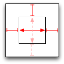

Now wire the `viewToSlideAndResize_` outlet of the `GTMWidthBasedTweaker` to the
box that is enclosing the text fields.  Lastly, wire in the
`GTMUILocalizerAndLayoutTweaker`, and at runtime, you'll see something like this:

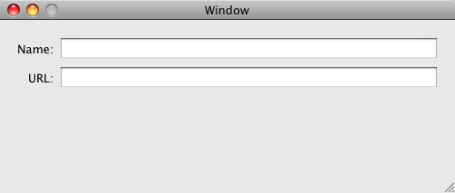

As the Tweaker grows or shirks based on the localization, it keeps the box
holding the text fields next to it and makes it grown/shirk as needed.  The
springs and struts on the text fields within that box are what make them size to
match.

#### _Example:_ A label and a text field where as the the label grows/shrinks for its text, the text field will move and grow/shrink to consume balance the label and a second label under the text field will be kept insync with it

Create the nib file, and set the title to be your localization key:

Then select the label and tell Interface Builder to embed the object into a
Custom View, and set the class of that view to `GTMWidthBasedTweaker`.  Set the
struts on the `GTMWidthBasedTweaker` so it is anchored to the top and left but
unanchored to the bottom and right.

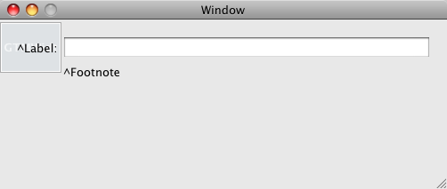 

Now wire the `viewToSlideAndResize_` outlet of the `GTMWidthBasedTweaker` to the
text field. Wire the `viewToSlide_` outlet to the label under the text field.
Lastly, wire in the `GTMUILocalizerAndLayoutTweaker`, and at runtime, you'll see
something like this:

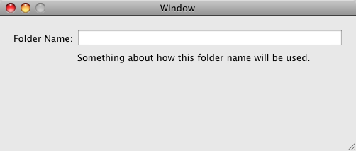

#### _Example:_ A label with a horizontal line that grows/shrinks with the label

Create the nib file, and set the title to be your localization key:

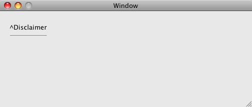

Then select the label and tell Interface Builder to embed the object into a
Custom View, and set the class of that view to `GTMWidthBasedTweaker`.  Set the
struts on the `GTMWidthBasedTweaker` so it is anchored to the top and left but
unanchored to the bottom and right.

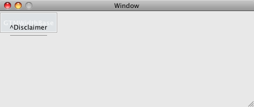 

Now wire the `viewToResize_` outlet of the `GTMWidthBasedTweaker` to the
horizontal line. Lastly, wire in the `GTMUILocalizerAndLayoutTweaker`, and at
runtime, you'll see something like this:

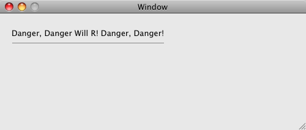

#### _Example:_ A label and a text field, how much the label grows/shrinks, the text field will move over and then the window will resize to match the label width change

Create the nib file, and set the title to be your localization key:

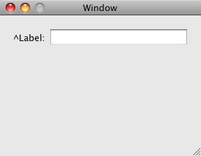

Then select the label and tell Interface Builder to embed the object into a
Custom View, and set the class of that view to `GTMWidthBasedTweaker`.

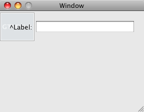

Set the struts on the `GTMWidthBasedTweaker` so it is anchored to the top and
left but unanchored to the bottom and right.

Set the struts of the Text Field so it is anchored to the top, left, and right
and its width with resize with the window.

Now wire the `viewToSlideAndResize_` outlet of the `GTMWidthBasedTweaker` to the
text field.  Wire the `viewToResize_` outlet to the window.  Lastly, wire in the
`GTMUILocalizerAndLayoutTweaker`, and at runtime, you'll see something like this:

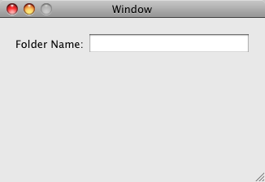

This may seem odd, but what happens is the text field will grow/shrink by the
opposite amount the label changed size.  Then the window size will be adjusted
by the same amount that the label changed size, putting the text field back at
the size it was to start with.

#### _Example:_ Using more then one `GTMWidthBasedTweaker`

You can use more then one `GTMWidthBasedTweaker` to handle your layout.  But you
really can only have one set to use its `viewToResize_` to point at the window.
But the combine effects can result in things like:

Initial setup:

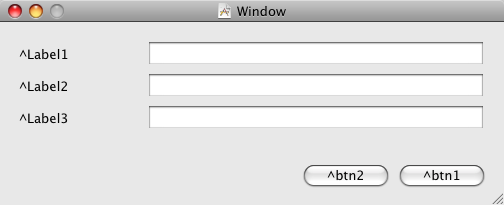

With the `GTMWidthBasedTweaker`s added:

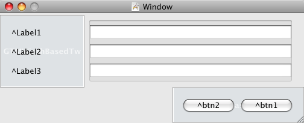

Resulting in:

